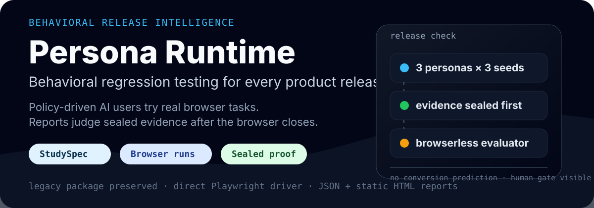
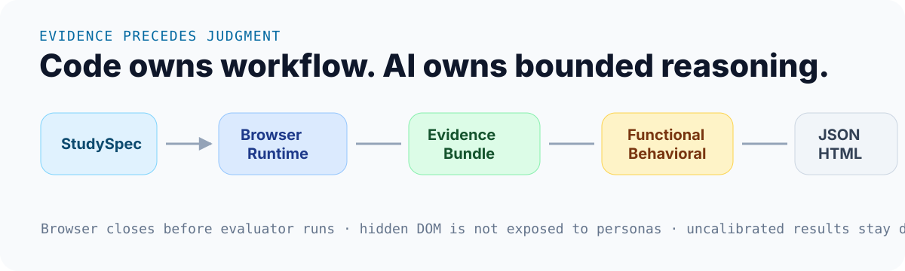

<p align="center">
  
</p>

<div align="center">

# Playwright Spec for AI Agent Workspace

**Behavioral regression testing for every product release — without breaking the legacy Playwright QA package.**

[](https://nodejs.org)
[](https://pnpm.io)
[](https://playwright.dev)
[](https://www.npmjs.com/package/playwright-spec-for-ai-agent)

[Persona Runtime](#persona-runtime) · [Run the demo](#run-the-demo) · [CLI](#cli) · [Packages](#packages) · [Legacy package](#legacy-package)

</div>

---

This repository now contains two related systems:

| System | Status | What it does |
| --- | --- | --- |
| [`persona-runtime`](./apps/persona-runtime-cli/README.md) | workspace app | Runs behavior-policy browser sessions, seals evidence, evaluates outcomes, and writes JSON + static HTML reports. |
| [`playwright-spec-for-ai-agent`](./packages/playwright-spec-for-ai-agent/README.md) | npm compatibility package | Preserves the original `spec → abstract-ai → judge → review → slack` Hermes-based live QA flow. |

The new runtime is not a conversion-rate oracle. It is a release-risk tool: AI users with different behavior policies attempt real browser tasks, and the report shows where sessions succeeded, got stuck, backed out, or abandoned — with evidence links and validity warnings.

## Persona Runtime

<p align="center">
  
</p>

The runtime follows four rules that matter for release decisions:

1. **Evidence precedes judgment.** Browser sessions write sealed evidence before evaluation.
2. **Code owns workflow.** State transitions, budgets, safety gates, deterministic oracles, and report generation stay in code.
3. **AI is bounded.** Persona policy chooses from allowed user actions; evaluation reads evidence after the browser is closed.
4. **Synthetic results stay scoped.** Reports show calibration and human-validation boundaries instead of predicting real conversion impact.

## Run the demo

The included hidden-CTA fixture serves a small page where the next action is below the initial mobile viewport.

```bash
corepack enable
pnpm install --frozen-lockfile
```

Terminal 1:

```bash
pnpm fixture:hidden-cta
```

Terminal 2:

```bash
pnpm persona-runtime validate examples/hidden-cta/study.yaml
pnpm persona-runtime run examples/hidden-cta/study.yaml --output=.qa/hidden-cta
```

Open the report:

```text
.qa/hidden-cta/reports/report.html
```

The run writes canonical JSON next to the HTML report:

```text
.qa/hidden-cta/
├── summary.json
├── validity.json
├── findings.json
├── reports/
│   └── report.html
└── sessions/
    └── <session-id>/
        └── evidence-manifest.json
```

## CLI

The workspace script forwards to `apps/persona-runtime-cli/bin/persona-runtime.mjs`.

```text
persona-runtime validate <study.yaml>
persona-runtime run <study.yaml> [--output=.qa/run]
persona-runtime compare <study.yaml> --baseline=<url> --candidate=<url> [--output=.qa/run]
persona-runtime import-playwright --spec-dir=<dir> --base-url=<url> --output=<study.yaml>
```

Workspace examples:

```bash
pnpm persona-runtime validate examples/hidden-cta/study.yaml
```

```bash
pnpm persona-runtime run examples/hidden-cta/study.yaml --output=.qa/hidden-cta
```

```bash
pnpm persona-runtime compare examples/hidden-cta/study.yaml --baseline=http://127.0.0.1:4179 --candidate=http://127.0.0.1:4179 --output=.qa/hidden-cta-compare
```

```bash
pnpm persona-runtime import-playwright --spec-dir=path/to/specs --base-url=https://staging.example.com --output=.qa/imported-study.yaml
```

## Packages

| Package | Role |
| --- | --- |
| `apps/persona-runtime-cli` | CLI assembly for validate/import/run/compare. |
| `packages/contracts` | Versioned StudySpec, evidence, evaluation, finding, and validation contracts. |
| `packages/runtime-core` | Session state machine, orchestration, budgets, and filesystem session store integration. |
| `packages/playwright-driver` | Direct Playwright browser/context/page driver and evidence capture. |
| `packages/persona-policy` | Seeded behavior presets, attention filtering, and abandonment policy. |
| `packages/evaluator` | Functional evaluation, behavioral fingerprints, findings, validity, and variant comparison. |
| `packages/reporter-html` | Static HTML report renderer. |
| `packages/reporter-github` | GitHub Check/comment formatter primitives. |
| `packages/playwright-spec-adapter` | Legacy Playwright spec parser and StudySpec compiler. |
| `packages/playwright-spec-for-ai-agent` | Backwards-compatible npm package and Hermes/QA Native commands. |

## Legacy package

The original npm package remains available and keeps its command shape:

```bash
npx playwright-spec-for-ai-agent spec --page=pricing
```

```bash
npx playwright-spec-for-ai-agent abstract-ai --page=pricing
```

```bash
npx playwright-spec-for-ai-agent judge --page=pricing
```

```bash
npx playwright-spec-for-ai-agent review --page=pricing
```

```bash
npx playwright-spec-for-ai-agent slack --page=pricing
```

```bash
npx playwright-spec-for-ai-agent nightly --page=pricing
```

Use it when Playwright specs are your QA intent source and Hermes should judge a staging page. Use Persona Runtime when you want independent browser sessions, sealed evidence, behavior-policy personas, validity output, and baseline/candidate comparison.

## Validate the workspace

```bash
pnpm build
```

```bash
pnpm typecheck
```

```bash
pnpm lint
```

```bash
pnpm test
```

```bash
pnpm package:smoke
```

## Limits

- `persona-runtime` is a workspace app in this repository, not a separately published npm package.
- Synthetic sessions are decision support. Without real user calibration, reports stay `uncalibrated` and should not be phrased as user conversion predictions.
- Study files are trusted operator inputs. For CI or hosted use, restrict targets with explicit allowed origins/hosts.
- Legacy `playwright-spec-for-ai-agent` behavior is intentionally preserved; new behavioral runtime work lives outside the old script pipeline.

## Docs

The implementation plan and architectural constraints live in [`docs/`](./docs/README.md).
