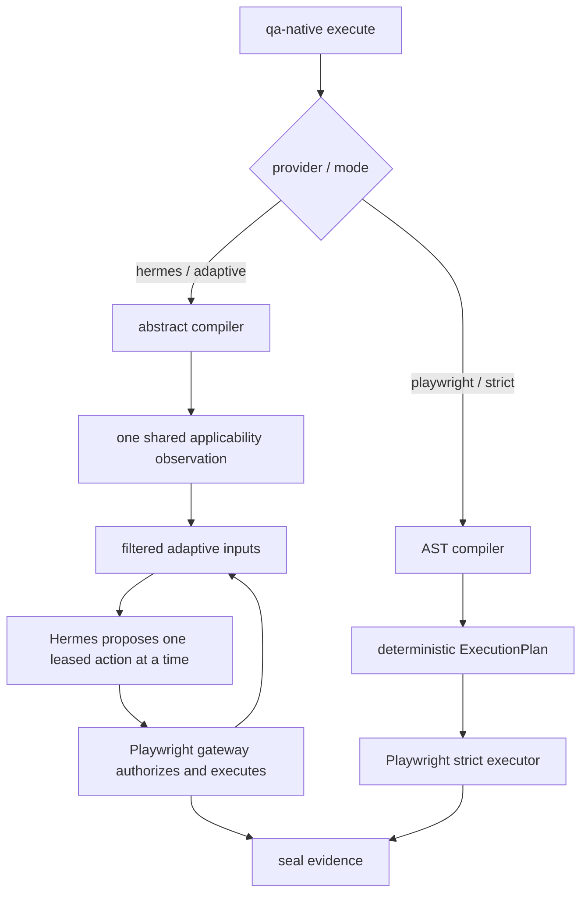
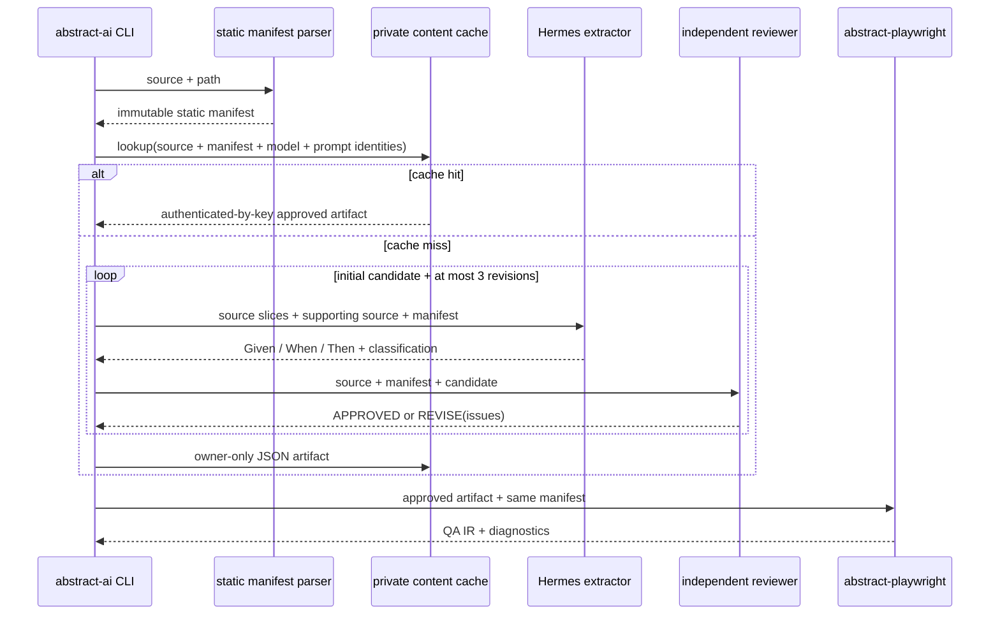
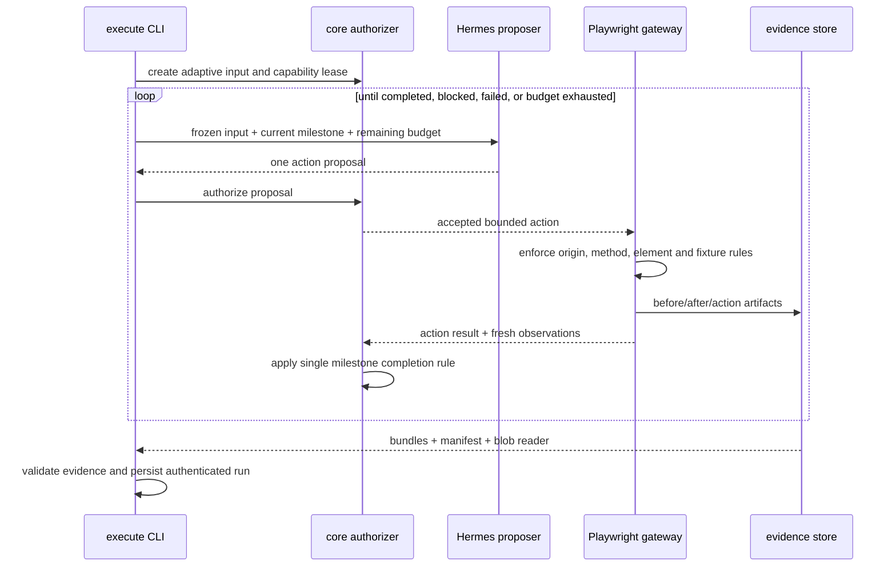
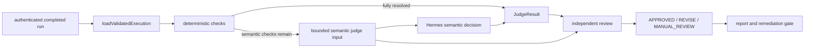
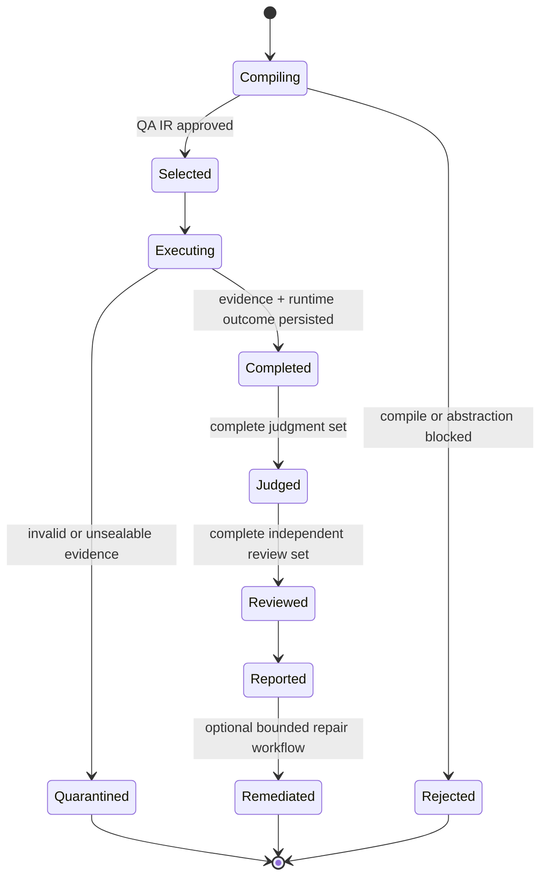
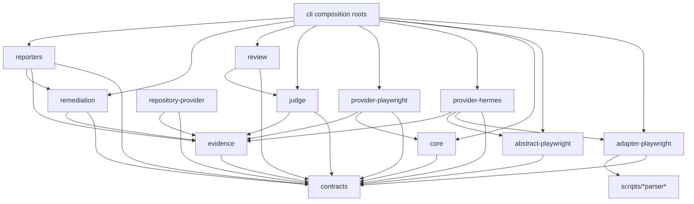

# QA Native Architecture

This document is the implementation map for `apps/playwright-spec-for-ai-agent`.
Read it with `AGENTS.md` before changing the pipeline. `AGENTS.md` owns working
rules and change matrices; this file owns runtime boundaries, data flow, and
compatibility expectations.

## System goal

QA Native converts authored Playwright intent into bounded live-browser
evidence. The execution agent may choose actions, but it cannot grant policy,
declare a verdict, select a file, or turn its own claim into a test result.

```text
Playwright spec
  → static manifest (AST: identity, policy, fixtures, safe authored targets)
  → abstract-ai (explicit Given / When / Then semantics)
  → applicability preflight (one read-only live-page observation)
  → adaptive or strict execution (applicable/ambiguous scenarios only)
  → sealed evidence + authenticated run envelope
  → evidence-only judge
  → independent judgment review
  → report/remediation/publication
```

Static analysis owns authority. AI owns interpretation and action proposals.
Code-owned contracts, browser policy, evidence validation, and reviewers remain
the trust boundaries.

## How to read this architecture

The pipeline separates four different kinds of truth. Keeping them separate is
the main architectural constraint:

1. **Authority** — what may run and what capabilities it receives. This comes
   only from source annotations, static parsing, contracts, and code-owned
   runtime guards.
2. **Meaning** — what the test is trying to establish. Abstract AI may interpret
   this as Given/When/Then, but cannot turn meaning into authority.
3. **Observation** — what actually happened in the browser. Only sealed evidence
   and authenticated run metadata are accepted downstream.
4. **Decision** — whether the observation satisfies the authored meaning. Judge
   and review operate after execution and cannot retroactively grant actions.

```mermaid
flowchart LR
  subgraph Authoring["Author-owned input"]
    Spec["Playwright spec"]
    Config["hermes-qa.config.mjs"]
    Storage["Private auth state / fixture files"]
  end

  subgraph Compilation["Compilation and interpretation"]
    Parser["AST + annotation parsers"]
    Manifest["Static manifest<br/>identity + policy + fixtures"]
    Extract["Hermes GWT extractor"]
    ExtractReview["Independent abstraction review"]
    QAIR["QA IR"]
  end

  subgraph Runtime["Live bounded execution"]
    Preflight["Read-only applicability preflight"]
    Core["Plan / lease / milestone state"]
    Browser["Playwright gateway"]
    Evidence["Sealed evidence archive"]
    Envelope["Authenticated run envelope"]
  end

  subgraph Decision["Post-execution decision"]
    Judge["Deterministic + semantic judge"]
    Review["Independent judgment review"]
    Report["Report / remediation / publication"]
  end

  Spec --> Parser --> Manifest
  Spec --> Extract
  Manifest --> Extract
  Extract --> ExtractReview --> QAIR
  Manifest --> QAIR
  Config --> Preflight
  Storage --> Browser
  QAIR --> Preflight --> Core --> Browser --> Evidence
  QAIR --> Envelope
  Evidence --> Envelope
  Evidence --> Judge --> Review --> Report
  QAIR --> Judge
  Envelope --> Judge
```



The arrows do not all carry the same power. For example, the AI extraction
arrow carries descriptions, while the manifest-to-QA-IR arrow carries policy.
The browser gateway trusts the latter and treats the former as an execution
goal only.

## Primary data objects

| Object                  | Produced by                                    | Consumed by                                   | What it is allowed to decide                                                         |
| ----------------------- | ---------------------------------------------- | --------------------------------------------- | ------------------------------------------------------------------------------------ |
| Playwright source       | Application authors                            | parsers, abstract AI                          | authored intent and annotations                                                      |
| Static manifest         | `adapter-playwright`                           | abstract compiler, cache, runtime compilation | identity, policy, fixtures, safe authored targets                                    |
| Abstraction artifact    | `abstract-playwright` + reviewed Hermes output | abstract compiler, cache, Markdown view       | Given/When/Then meaning and live classification only                                 |
| QA IR                   | AST or abstract compiler                       | core, providers, judge, review, report        | immutable scenario model combining code-owned authority and approved meaning         |
| Execution plan          | `core` strict planner                          | Playwright strict provider                    | exact deterministic node order and bindings                                          |
| Execution agent input   | `core` adaptive planner                        | Hermes proposer, Playwright gateway           | leased actions, budget, current milestone, bounded goal                              |
| Execution agent outcome | adaptive runtime                               | evidence validator, run envelope, reports     | completion/error state and completed milestone IDs; never a verdict                  |
| Evidence bundle         | Playwright provider                            | judge, review, remediation                    | captured browser facts and artifact references                                       |
| Evidence manifest       | evidence store                                 | archive reader, run envelope                  | ordered sealed checkpoint index                                                      |
| Run envelope            | CLI run-envelope module                        | every downstream command                      | authenticated hashes binding QA IR, runtime result, evidence, and execution metadata |
| Judge result            | `judge`                                        | review, report, remediation                   | provisional `PASS`/`FAIL`/`SKIP`/`MANUAL_REVIEW`                                     |
| Judgment review         | `review`                                       | report and publication gates                  | approve or reject grounding; never replace the verdict                               |

## Supported execution compositions

The CLI is the composition root. It permits only these production pairs:

| Provider / mode       | Default compiler | Behavior                                                   | AI involvement                                                                 |
| --------------------- | ---------------- | ---------------------------------------------------------- | ------------------------------------------------------------------------------ |
| `hermes / adaptive`   | `abstract`       | AI interprets meaning and proposes bounded browser actions | extraction, preflight, action proposal, semantic judgment, independent reviews |
| `playwright / strict` | `ast`            | code executes a deterministic read-only plan               | optional legacy semantic fallback for unsupported AST meaning; no action agent |

`--compiler=ast` remains available for compatibility. Abstract compilation is
accepted only with Hermes adaptive execution because its semantic milestones
require the adaptive evidence path. Page mode resolves multiple configured spec
files, a target path, base URL, and implicit partial execution from project
configuration; explicit `--spec` mode runs one file and requires a base URL.



## Pipeline stages

### 1. Static manifest

`scripts/playwright-ast-parser.mjs` and
`scripts/dashboard-spec-parser.mjs` extract test boundaries, annotations,
`@qa-live-policy`, `@qa-fixture`, and the safe subset of authored Playwright
targets. Unsupported authority-bearing syntax fails closed. Static parsing does
not attempt to understand the full behavioral meaning of a test.

### 2. Abstract AI

`packages/provider-hermes/index.mjs` extracts, and independently reviews, each
test as an explicit behavioral contract:

- **Given**: only material initial conditions observable before the flow,
- **When**: the authored user or system flow,
- **Then**: observable claims that must hold after the flow,
- live classification.

Given is not a reconstruction of test fixtures or hidden API setup. When a
Then claim directly exposes the relevant product state, the internal mock,
endpoint, or payload that produced it is not an additional applicability gate.
Given also cannot presuppose the presence, absence, or state of the subject
that Then evaluates; otherwise a real product regression would be skipped as
not applicable instead of reaching judgment.

The approved abstraction artifact uses `given`, `when`, and `then` directly.
During compilation these map to the existing QA IR semantic fields
`applicability`, `when`, and `claims`, preserving old authenticated run and
judge compatibility while making the AI extraction boundary unambiguous.

`packages/abstract-playwright/index.mjs` combines approved semantics with the
immutable static manifest. AI output cannot add policy, selectors, actions,
fixtures, or verdicts. Cache keys include source, manifest, prompt, model, and
review identity so stale meaning cannot silently survive a change.

Large specs are extracted and independently reviewed in bounded batches of at
most eight tests. A timeout, invalid model envelope, or batch validation failure
retries only the failed batch at half size down to one test; successful batches
are never repeated. A retryable single-test timeout or invalid response is tried
once more, then fails closed. Approved results are stored in the private content-addressed
cache, while changed source, manifest, model, or prompt/reviewer versions force
fresh extraction.
Three reviewed revisions are allowed; a fourth independent rejection remains
`MANUAL_REVIEW` and never reaches compilation or execution.



### 3. Applicability preflight

Adaptive execution performs one read-only observation of the configured live
page before opening per-scenario sessions. Hermes compares that observation
with only every compiled scenario's approved, pre-flow Given conditions and
returns one decision per scenario. Scenario titles, claims, and
post-action states are not selector input, so an authored destination or dialog
cannot be mistaken for a missing initial prerequisite:

Applicability is limited to initial live conditions a read-only observation can
establish: route, account state, product state, counts, and retained data.
Future mocked responses, route-handler payloads, fixture identities, uploads,
destination URLs, dialogs, requests, and toasts remain in authored flow or
claims; they are never reasons to skip before execution.

| Decision               | Runtime behavior                                                     |
| ---------------------- | -------------------------------------------------------------------- |
| `APPLICABLE`           | Execute.                                                             |
| `NOT_APPLICABLE`       | Do not execute or judge as a failure. Report separately.             |
| `AMBIGUOUS`            | Execute to preserve legacy coverage; the later judge may resolve it. |
| statically unsupported | Existing compile/`--allow-partial` path; never delegated to AI.      |

Only a high-confidence, complete `NOT_APPLICABLE` decision may remove a
scenario from execution. Missing, malformed, duplicate, low-confidence, or
selector-failure decisions become `AMBIGUOUS`, preserving the preflight-free
legacy behavior. Preflight cannot grant a scenario more policy than its static
manifest. The runtime gives the selector short, run-local scenario keys and
maps validated decisions back to immutable scenario IDs; the model never has to
copy or reconstruct authority-bearing internal hashes.

The complete decision set is stored in `qaIr.extensions.applicabilityDecisions`.
Because `qa-ir.json` is hashed by the authenticated run envelope, later commands
can report the selection without trusting an unauthenticated side file.

### 4. Execution

`packages/core/index.mjs` builds strict plans or adaptive inputs and owns the
single milestone-completion rule. `packages/provider-playwright/index.mjs`
enforces browser capabilities and seals every accepted or failed action.

Adaptive recovery is autonomous: the agent may click a structurally safe
observed element, press Escape, hover, scroll, or wait. A recovery action never
completes an exact authored milestone. Exact completion requires a fresh
authored locator used by the successful browser action and a corresponding
`satisfiedMilestoneIds` proof in sealed evidence.

Network policy is code-owned. Adaptive mode permits only `GET`/`HEAD` to exact
leased origins, closes WebSockets, blocks mutations, and drains pending policy
decisions before sealing success. File uploads use only an author-designated
`@qa-fixture` inside the project root.



### 5. Evidence

`packages/evidence/index.mjs` captures bounded, redacted artifacts, HMAC-sealed
manifests, and private archives. `packages/cli/qa-native-adaptive-evidence.mjs`
validates action ordering and delegates completion semantics to core. Rejected
actions such as pointer interception are sealed as `EXECUTION_FAILED`; they do
not advance a milestone and stale observations are discarded.

Evidence is never deleted. Invalid runs are quarantined to `<run-dir>.invalid`
and every downstream command refuses them.

### 6. Judge and review

`packages/judge/index.mjs` evaluates only sealed evidence. It may return
`PASS`, `FAIL`, `SKIP`, or `MANUAL_REVIEW`. A scenario whose material
applicability is affirmatively not met is `SKIP`, not `PASS`, `FAIL`, or
`MANUAL_REVIEW`.

The CLI composition root injects `createHermesSemanticJudge()` into
`judgeEvidence()`. Hermes owns prompt and transport behavior; the judge owns
verdict construction. The exported `judgeWithHermes()` facade remains only for
backward compatibility and delegates through the same two functions.

Missing evidence for an internal mock, helper, or setup request is not an
applicability conflict when the required route/account/product state and the
user-visible claim are directly established by sealed page evidence. Internal
network setup matters only when that network behavior is itself an authored
claim or is required to distinguish the visible product state.

`packages/review/index.mjs` uses an independent invocation to check grounding.
Review approval means the judgment is evidence-supported; it does not change
the verdict and is not an application PASS.



### 7. Report and remediation

Reports separate:

- executed judgments by verdict,
- preflight `NOT_APPLICABLE` scenarios,
- statically unsupported/blocked scenarios,
- unapproved reviews.

Only `FAIL` and approved `MANUAL_REVIEW` judgments enter remediation. `SKIP`
and preflight `NOT_APPLICABLE` never count as failing. Publication remains
authenticated and has no merge or auto-merge path.

## Module ownership

| Module                                            | Owns                                                                                                                                      | Must not own                                               |
| ------------------------------------------------- | ----------------------------------------------------------------------------------------------------------------------------------------- | ---------------------------------------------------------- |
| `packages/contracts`                              | Schemas, versions (including the static-manifest version), action vocabulary                                                              | Browser behavior or prompt policy                          |
| `scripts/*parser*`, `packages/adapter-playwright` | Static identity and authority                                                                                                             | Semantic guessing                                          |
| `packages/abstract-playwright`                    | Manifest + approved semantics composition                                                                                                 | Live decisions                                             |
| `packages/provider-hermes`                        | Hermes prompt construction and transport adapters, including the injected semantic-judge function                                         | Execution orchestration, enforcement, or verdict promotion |
| `packages/core`                                   | Plans, leases, milestones, completion rule                                                                                                | Browser I/O                                                |
| `packages/provider-playwright`                    | Browser I/O, network policy, evidence capture                                                                                             | Verdicts                                                   |
| `packages/evidence`                               | Redaction, storage, HMAC, archive I/O                                                                                                     | Scenario semantics                                         |
| `packages/cli/qa-native-adaptive-evidence`        | Cross-layer evidence sequencing                                                                                                           | A second completion-rule copy                              |
| `packages/judge`                                  | Evidence → verdict                                                                                                                        | Browser access or execution claims as facts                |
| `packages/review`                                 | Independent judgment grounding                                                                                                            | Replacement verdicts                                       |
| `packages/cli/*`                                  | Composition root, orchestration, and authenticated persistence; CLI judge composes `judgeEvidence` with the Hermes semantic-judge adapter | Duplicated domain rules                                    |
| reporters/remediation/repository providers        | Presentation and bounded repair workflow                                                                                                  | New evidence or authority                                  |

## Module mechanics

### `packages/contracts`

This is the schema and vocabulary kernel. It owns contract version constants,
`validateContract`, immutable `snapshotContract`, canonical hashing, verdict and
status vocabularies, `ACTION_SPECS`, and the shared adaptive audit shape.

- **Input:** plain JavaScript values crossing a trust or persistence boundary.
- **Work:** reject unknown keys, invalid enum values, oversized collections,
  broken references, inconsistent IDs, or incompatible schema versions.
- **Output:** validated or frozen snapshots suitable for hashing and downstream
  use.
- **Coupling rule:** many modules depend on contracts; contracts depends only on
  Node crypto. This high fan-in and near-zero fan-out is intentional.

The static-manifest version also lives here. Adapter and abstract compilers may
share the version without importing each other's implementation.

### `scripts/playwright-ast-parser.mjs` and `scripts/dashboard-spec-parser.mjs`

The TypeScript AST parser finds executable test boundaries and supported
Playwright syntax without evaluating the spec. The dashboard parser associates
those syntax blocks with `@qa-scenario`, `@qa-page`, `@qa-live-policy`,
`@qa-fixture`, `@qa-always-run`, and `@qa-live-skip` annotations.

- Parser offsets are retained so diagnostics can be attributed to one test.
- Unsupported authority-bearing syntax produces diagnostics rather than a
  guessed capability.
- Shared or inherited annotations are resolved deterministically.
- The parser never contacts Hermes and never grants runtime browser access.

### `packages/adapter-playwright`

The adapter converts parser output into code-owned compilation artifacts.

- `extractPlaywrightStaticManifest` emits test identity, source ranges, policy,
  fixtures, modifiers, and the small safe subset of authored action targets.
- `compilePlaywrightSpec` builds deterministic QA IR for the AST path.
- `recoverPlaywrightSpecWithAi` can add semantic claims when a known recoverable
  AST diagnostic prevents deterministic meaning extraction, but it preserves
  the original static policy and identity.
- Compilation fails closed per scenario. `--allow-partial` may remove a blocked
  scenario; it never fabricates the missing operation.

### `packages/abstract-playwright`

This module owns full-spec semantic abstraction artifacts and their compilation.

- It validates exact one-to-one coverage of every static manifest `testId`.
- It normalizes new `given/when/then` output and accepts the legacy
  `applicability/when/claims` response shape only as an input compatibility shim.
- It runs the reviewed-revision loop and records candidate hashes and review
  feedback.
- It maps approved GWT fields onto the existing QA IR semantics without letting
  the AI alter policy, selectors, fixtures, or actions.
- A rejected or malformed abstraction becomes `MANUAL_REVIEW`; it does not fall
  through to an unreviewed execution.

### `packages/provider-hermes`

This is the Hermes-specific prompt and transport adapter. It contains prompt
builders and factories for:

- single-test semantic fallback;
- full-spec GWT extraction and independent abstraction review;
- applicability selection;
- adaptive action proposal;
- semantic evidence judgment;
- independent judgment and remediation reviews;
- bounded patch proposals.

Every prompt has a version included in cache or run comparison identity. Model
responses are normalized at the receiving domain boundary. The provider may
return descriptions or proposed actions, but runtime code still validates all
authority.

`createHermesSemanticJudge()` returns an injectable semantic decision function.
The CLI combines it with `judgeEvidence()`; the provider does not construct the
final verdict. `judgeWithHermes()` remains as a compatibility facade.

### `packages/core`

Core owns execution state transitions and contains no browser I/O.

- Strict mode: `createExecutionPlan`, `executePlan`, and
  `validateExecutionPlanBinding` bind QA IR to provider capabilities.
- Adaptive mode: `createAdaptiveExecutionInput` creates milestones, lease,
  origin list, budget, and bounded textual goal.
- `createAdaptiveActionAuthorizer` checks leases and action/time/turn/token
  budgets before an action reaches Playwright.
- `milestoneCompletionRule` is the single necessary-condition definition used
  by both live runtime and persisted-evidence validation.
- `advanceAdaptiveMilestone` applies fresh results and prevents recovery actions
  from completing authored exact milestones.
- `observationSettleBudget` centrally bounds quiet-DOM waits below remaining run
  time so observation cannot become a run-killing timeout.

### `packages/provider-playwright`

This is the only module that operates the live browser.

Strict execution follows the code-owned plan. Adaptive execution exposes a
gateway that accepts only `ACTION_SPECS` actions and resolves agent-selected
observed elements without accepting arbitrary selectors from the model.

The provider enforces:

- direct navigation and allowed-origin rules;
- page-initiated network policy, method filtering, WebSocket blocking, and
  pending-request drain;
- safe recovery boundaries and protected element checks;
- exact authored action proof versus autonomous recovery actions;
- fixture path containment, no symlink escape, and size bounds;
- bounded screenshots, DOM/ARIA/visible-text, network, console, trace, and
  action artifacts.

It returns execution outcomes and in-memory evidence. It never returns a QA
verdict.

### `packages/evidence`

Evidence owns the observation lifecycle:

1. Create bounded in-memory bundles and content-addressed blobs.
2. Redact supplied secrets and sensitive-looking values.
3. Verify artifact hashes, bundle identities, checkpoint ordering, and storage
   references.
4. Persist private archive directories using no-follow, exclusive file I/O.
5. Authenticate the evidence manifest with HMAC.
6. Re-read only an exact expected directory shape and revalidate all bindings.

No downstream module may trust a loose screenshot, side JSON file, or execution
agent statement in place of a verified evidence artifact.

### `packages/cli/qa-native-adaptive-evidence.mjs`

This cross-layer validator checks persisted adaptive action ordering, proposal
and result bindings, required audit artifact counts, completed milestone IDs,
and outcome consistency. It delegates completion semantics to core rather than
maintaining a second rule. Both `execute` and `judge` pass through this validator.

### `packages/judge`

Judge converts authenticated evidence into a provisional test verdict.

- `evaluateDeterministically` resolves claims that code can prove directly.
- `buildSemanticJudgeInput` projects only bounded scenario context, unresolved
  expectations, and readable sealed evidence.
- `judgeEvidence` invokes an injected semantic judge only when deterministic
  evaluation leaves semantic work.
- Model metadata or execution-agent claims never become facts by themselves.
- Applicability conflicts produce `SKIP`; insufficient evidence produces
  `MANUAL_REVIEW` rather than an invented result.

Judge does not launch a browser, read repository code, or propose fixes.

### `packages/review`

Review independently checks the completed `JudgeResult` against the same sealed
evidence projection. It may return `APPROVED`, `REVISE`, or `MANUAL_REVIEW`.
Approval means the verdict and evidence citations are grounded; it does not
change the verdict. Reports use this as a gate before treating semantic failures
as remediation candidates.

### `packages/cli`

The CLI modules are composition roots and persistence coordinators:

| CLI module                   | Responsibility                                                                                                        |
| ---------------------------- | --------------------------------------------------------------------------------------------------------------------- |
| `qa-native.mjs`              | option parsing, supported command matrix, private path validation, exclusive filesystem helpers, handler dispatch     |
| `qa-native-abstract-ai.mjs`  | config/spec resolution, extractor/reviewer creation, content cache, Markdown abstraction views                        |
| `qa-native-execute.mjs`      | compiler selection, partial filtering, preflight, strict/adaptive orchestration, evidence persistence, run completion |
| `qa-native-run-envelope.mjs` | HMAC authentication and exact hash binding of persisted run components                                                |
| `qa-native-result-set.mjs`   | authenticated run loading and exact judgment/review set coverage checks                                               |
| `qa-native-judge.mjs`        | compose evidence judge with Hermes semantic adapter and persist one result per evidence bundle                        |
| `qa-native-review.mjs`       | run independent reviewer for a complete judgment set and persist reviews                                              |
| `qa-native-report.mjs`       | select actionable results, assemble repository context, render reports                                                |
| `qa-native-remediate.mjs`    | orchestrate proposal, application, verification, live rerun, integrity review, publication decision                   |

High CLI fan-out is expected because this layer deliberately wires domain
modules together. Domain rules must not be copied into CLI handlers merely to
avoid an import.

### `packages/repository-provider`

This module creates bounded repository snapshots and code-context bundles for
an evidence-backed diagnosis. It validates paths and revisions, returns hashes
with excerpts, and does not mutate the repository.

### `packages/remediation`

Remediation is an optional post-report workflow. It operates only on selected,
authenticated `FAIL` or approved `MANUAL_REVIEW` results.

```mermaid
flowchart LR
  Failure["approved actionable judgment"] --> Diagnose["diagnoseFailure"]
  Diagnose --> Context["bounded code context"]
  Context --> Recommend["recommendRepair"]
  Recommend --> Propose["AI PatchProposal"]
  Propose --> Apply["isolated patch application"]
  Apply --> Verify["configured verification checks"]
  Verify --> Rerun["bounded live scenario rerun"]
  Rerun --> Compare["before / after evidence comparison"]
  Compare --> Integrity["expectation integrity"]
  Integrity --> Independent["independent remediation review"]
  Independent --> Decision["publication decision"]
  Decision --> Draft["draft issue / verified draft only"]
```



Patch operations are bounded to declared files and ranges. Verification rejects
unexpected diff mutation. Publication has no merge or auto-merge capability.

### Reporters

`reporter-markdown` renders local evidence-backed diagnostic reports.
`reporter-github` owns GitHub-shaped reports, failure fingerprints, occurrence
records, and CLI transports. Reporters consume existing decisions; they cannot
create evidence, change a verdict, or bypass publication guards.

## Persisted private layout

All runtime artifacts live below the consumer repository's private `.qa`
directory. The CLI rejects traversal, symlink escapes, unexpected directory
members, and any path containing an `.invalid` component.

```text
.qa/
├── abstract/
│   ├── cache/
│   │   └── <content-key>.json       # manifest + provider identities + reviewed artifact
│   └── <page>/
│       └── <content-key>.md         # human-readable GWT view
└── runs/
    └── <run-id>/
        ├── qa-ir.json
        ├── execution-plan.json          # strict only
        ├── execution-agent-inputs.json  # adaptive only
        ├── execution-agent-outcomes.json# adaptive only
        ├── evidence/
        │   ├── archive-auth
        │   ├── evidence-manifest.json
        │   ├── bundles/<hash>.json
        │   └── blobs/<hash>
        ├── run.json
        ├── run-envelope.json
        ├── judgments/judge-<hash>/
        │   ├── judge-result-<hash>.json
        │   └── run.json
        ├── reviews/review-<hash>/
        │   ├── review-result-<hash>.json
        │   └── run.json
        └── reports/report-<hash>/
            ├── diagnosis-<hash>.json
            ├── code-context-<hash>.json
            ├── repair-recommendation-<hash>.json
            ├── report-<hash>.md
            └── run.json
```

If execution or persistence fails after a run directory is created, the
directory is renamed to `<run-id>.invalid`. Evidence already captured is kept
for forensic inspection, but normal commands refuse to read that directory.

## Run state and authentication



The run envelope authenticates the exact hashes of QA IR, runtime outcome,
evidence manifest, and either the strict execution plan or adaptive
input/outcome arrays. Downstream loading performs both archive verification and
run-envelope binding verification. A valid individual JSON object is
insufficient if it is not part of the authenticated set.

Judgments and reviews are stored as complete result sets. When more than one
judgment set exists, the operator must identify the intended directory with
`--judgment`; the tool never guesses which rerun is authoritative.

## Trust boundaries and threat model

| Boundary          | Untrusted input                              | Enforced protection                                                                            |
| ----------------- | -------------------------------------------- | ---------------------------------------------------------------------------------------------- |
| Source parsing    | spec text, comments, dynamic expressions     | TypeScript AST, bounded source reads, fail-closed diagnostics                                  |
| AI extraction     | source text, reviewer feedback, model output | text-only prompts, exact output shapes, manifest test-ID coverage, independent review          |
| Applicability     | DOM text and model selection                 | short runtime IDs, read-only observation, complete response validation, execute-all fallback   |
| Adaptive proposal | DOM text and action proposal                 | frozen agent input, capability lease, `ACTION_SPECS`, budgets, origin and element guards       |
| Browser network   | page requests and redirects                  | explicit origins, GET/HEAD policy, mutation/WebSocket blocking, redirect checks                |
| Fixture upload    | author paths and chosen element              | manifest designation, realpath containment, no symlink escape, byte limit                      |
| Evidence storage  | browser artifacts and metadata               | redaction, size/depth limits, hashes, HMAC, exact archive shape, no-follow writes              |
| Judgment          | evidence text and model response             | deterministic-first evaluation, bounded evidence refs, contract validation, independent review |
| Repository repair | AI patch content and repository files        | bounded context, allowed operations, hash/range validation, isolated verification              |
| Publication       | report content and remote state              | authenticated stages, fingerprints, occurrence records, draft-only publication                 |

Browser-visible text, spec comments, API responses, evidence contents, and
repository source may contain prompt injection. They are always serialized as
untrusted data. Prompts cannot be the only enforcement layer: every security or
authority decision must also have a code-owned validator.

## Failure semantics

| Condition                                                | Result                                                | Why                                                             |
| -------------------------------------------------------- | ----------------------------------------------------- | --------------------------------------------------------------- |
| Unsupported authority syntax                             | compile diagnostic / blocked scenario                 | guessing could grant unsafe capability                          |
| Abstract candidate repeatedly rejected                   | `MANUAL_REVIEW` artifact                              | unreviewed meaning cannot execute                               |
| Applicability response malformed or unavailable          | all affected scenarios become `AMBIGUOUS` and execute | selection failure must not erase coverage                       |
| High-confidence initial-state conflict                   | preflight `NOT_APPLICABLE`                            | scenario does not describe current live state                   |
| Adaptive target blocked or absent after bounded recovery | sealed blocked/error evidence                         | agent claim is retained but not promoted to verdict             |
| Budget exhausted                                         | `ExecutionAgentOutcome: ERROR` with partial evidence  | finite execution is a hard runtime invariant                    |
| Evidence binding or HMAC failure                         | `<run>.invalid` quarantine                            | unverifiable observation cannot be judged                       |
| Claim contradicted after applicable flow                 | `FAIL`                                                | evidence establishes a product/test discrepancy                 |
| Applicable flow reached but evidence insufficient        | `MANUAL_REVIEW`                                       | absence of evidence is not evidence of absence                  |
| Executed scenario proven inapplicable                    | `SKIP`                                                | execution occurred, but claim is not judged against wrong state |
| Judgment citations unsupported                           | review `REVISE` or `MANUAL_REVIEW`                    | provisional verdict cannot pass the report gate                 |

## Dependency direction



The central modules intentionally have different coupling profiles:

- `contracts` has high fan-in and almost no fan-out because it is the stable
  kernel.
- providers have bounded fan-out to contracts, core, and evidence because they
  implement external I/O boundaries.
- CLI handlers have high fan-out by design; they are composition roots.
- domain modules must not import CLI handlers to recover business rules.

## Debugging map

| Symptom                                        | Start here                                            | Then inspect                                                        |
| ---------------------------------------------- | ----------------------------------------------------- | ------------------------------------------------------------------- |
| Wrong test count, policy, or fixture           | parser diagnostics and static manifest                | `dashboard-spec-parser`, `adapter-playwright`                       |
| Wrong Given/When/Then                          | abstraction cache Markdown and review attempts        | Hermes abstraction/review prompts, `abstract-playwright` normalizer |
| Too many `NOT_APPLICABLE` results              | authenticated `qa-ir.json` applicability decisions    | preflight observation and applicability prompt                      |
| Agent loops or budget exhaustion               | `execution-agent-inputs/outcomes.json`                | core budget, proposal log, fresh observation rules                  |
| Click blocked or wrong element                 | action audits and element observations                | Playwright gateway and authored milestone target                    |
| Judge says `SKIP`/`MANUAL_REVIEW` unexpectedly | judge result evidence refs                            | semantic input projection, sealed visible text/ARIA/URL             |
| Reviewer rejects a plausible verdict           | review issues and cited judgment                      | missing/truncated evidence or unsupported absence claim             |
| Report refuses a run                           | run envelope, archive auth, completed set directories | `qa-native-result-set`, `.invalid` quarantine rule                  |
| Remediation cannot publish                     | stage envelopes, integrity and publication decisions  | verification diff, evidence comparison, independent review          |

## Compatibility rules

1. Strict mode, `--compiler=ast`, and old authenticated runs remain readable.
2. Additive optional QA IR extensions do not change action authority.
3. If applicability preflight fails, adaptive execution falls back to the old
   execute-all behavior instead of silently dropping coverage.
4. Prompt changes bump their prompt version. Contract field changes follow the
   `AGENTS.md` schema-version and legacy-read matrix.
5. A new action changes `ACTION_SPECS` first; every consumer derives from it.
6. Completion semantics change only in `milestoneCompletionRule`; runtime and
   evidence validation share it.
7. Partial or failed scenarios preserve every already-sealed bundle.
8. Downstream commands consume authenticated QA IR, evidence, and run-envelope
   bindings; diagnostic side files never grant authority.
9. Compiler stages share schema/version identity through `packages/contracts`;
   abstract compilation must not import the AST adapter merely to compare a
   manifest version.

## Change checklist

Before merging a pipeline change, walk the relevant `AGENTS.md` matrix and run:

```bash
pnpm vitest run packages/cli/__tests__/qa-native-adaptive-matrix.test.mjs
pnpm test
```

For applicability changes additionally verify:

1. one live observation is shared across scenario selection;
2. high-confidence inapplicable scenarios are not executed;
3. ambiguous or selector-failure scenarios still execute;
4. `SKIP`/`NOT_APPLICABLE` are not reported as failures;
5. strict and AST compatibility tests remain green;
6. an authenticated live run completes execute → judge → review → report.
