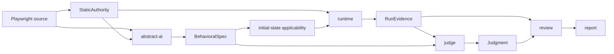

# QA Native v3 Architecture

QA Native v3 is a breaking, AI-native pipeline. It keeps static code in charge
of authority and security, while AI owns behavioral interpretation and semantic
decisions.

```text
Playwright spec
  → static-authority
  → abstract-ai
  → runtime
  → evidence
  → judge
  → review
  → report
```

There is one production composition. v3 does not carry the v2 AST semantic
compiler, strict executor, old artifact readers, partial compiler recovery, or
remediation/publication workflow.

## Design rules

1. **Static code owns authority.** Only annotations and configuration may grant
   browser, network, or fixture capabilities.
2. **AI owns meaning.** Given/When/Then and semantic verdicts are never rebuilt
   from an AST after abstraction.
3. **The browser produces observations, not verdicts.** Runtime outcomes and
   execution-agent claims are not PASS/FAIL evidence by themselves.
4. **Every persisted decision is evidence-bound.** Judge and review consume the
   sealed run produced by the same invocation.
5. **One context, one security parser.** URL, headers/cookies, structured JSON,
   and free text have separate redaction paths. A universal sensitive-key regex
   is forbidden.
6. **No compatibility branches.** A v2 artifact must be regenerated by v3.

## Data flow



Only five persisted contracts cross stage boundaries:

| Contract | Contents | Authority |
| --- | --- | --- |
| `StaticAuthority` | test identity, source range, policy, fixture names, configured origins | code-owned |
| `BehavioralSpec` | one reviewed Given/When/Then contract per test | AI meaning, code-validated identity |
| `RunEvidence` | action audit and redacted browser observations | sealed browser facts |
| `Judgment` | PASS/FAIL/SKIP/MANUAL_REVIEW with evidence references | judge decision |
| `Review` | APPROVED or MANUAL_REVIEW grounding result | independent review |

Intermediate prompts, proposals, observations, budgets, and browser handles are
runtime-local values. They are not separate public artifact families.

## Stage ownership

### `static-authority`

The only AST-backed stage. It reads test boundaries and the following authored
annotations without evaluating the spec:

- `@qa-scenario`
- `@qa-live-policy`
- `@qa-fixture`
- `@qa-always-run`
- `@qa-live-skip`

It emits `StaticAuthority`. It does not extract expectations, infer product
states, recover unsupported Playwright syntax, or build an execution plan.
Unsupported or missing authority fails closed for that test.

### `abstract-ai`

The extractor receives bounded test source slices and immutable authority. It
returns explicit Given/When/Then behavior. An independent reviewer then returns
one of:

```json
{ "status": "APPROVED", "spec": { "tests": [] } }
```

```json
{ "status": "MANUAL_REVIEW", "reason": "..." }
```

The reviewer corrects the candidate directly. There is no issue-scope prefix,
previous-candidate revision loop, or extractor/reviewer ping-pong. Transport
timeouts may retry the same call once; semantic rejection does not retry.

The code accepts an approved result only when every authority test ID appears
exactly once and no policy, fixture, action, selector, or verdict field exists.
Approved artifacts are cached by source, authority, model, and prompt identity.

### `runtime`

Runtime combines the previous adaptive core and Playwright gateway behind one
module. For each behavioral test it:

1. opens the code-owned configured URL once and captures a read-only initial
   observation;
2. compares every extracted Given with that observation through a bounded AI
   call and retains only explicitly applicable tests;
3. gives the execution AI only When and Then;
4. authorizes one proposed action against the test capability;
5. executes it through Playwright;
6. records before/action/after evidence;
7. stops on completion, explicit block, error, or a run-wide budget.

Applicability may only remove behavior. It cannot add tests, alter Given/When/
Then, grant policy, or produce a verdict. `NOT_APPLICABLE` and `AMBIGUOUS`
tests do not launch an execution browser; an empty selection fails closed.

Runtime does not implement deterministic semantic milestones. The agent may say
that it is done, but the later judge decides whether Then is satisfied.

Network authority comes from `@qa-live-policy`:

| Policy capability | Network behavior |
| --- | --- |
| observe only | leased-origin GET/HEAD only; no WebSocket |
| interaction | every method and WebSocket on exact leased origins |
| blocked | no browser session |

Unleased origins, undeclared fixture files, arbitrary selectors, credentialed
URLs, and model-supplied file paths are always rejected. Pending route decisions
drain before evidence is sealed.

### `evidence`

Evidence owns capture, bounded storage, redaction, hashing, and HMAC sealing.
It exposes four explicit sanitizers:

- `redactUrl` parses credentials and query parameters;
- `redactHeaders` handles authorization and cookies;
- `redactStructured` walks JSON using unambiguous credential fields;
- `redactText` finds embedded URLs/header lines and high-confidence opaque
  secrets without interpreting arbitrary product keys as credentials.

The archive is written once at the end of the run. A sealing failure preserves
the directory as `<run>.invalid`; downstream stages refuse it.

### `judge`

Judge receives only `BehavioralSpec` and sealed `RunEvidence`. It asks an AI to
evaluate Given/When/Then against cited evidence and validates the returned
verdict and references. Code handles only structural cases:

- statically blocked → `SKIP`;
- no seal or broken reference → `MANUAL_REVIEW`;
- otherwise → AI judgment.

There is no deterministic DOM/route semantic shortcut.

### `review`

Review is a distinct AI invocation. It checks that each judgment is supported
by its cited sealed evidence. It may approve or require manual review; it may
not replace the verdict.

### `report`

Report is a pure renderer over the complete judgment and review sets. It does
not inspect repository code, propose patches, publish issues, or make new AI
calls.

## Composition root

The default command runs the complete pipeline:

```bash
qa-native run (--page=<name> | --spec=<file>) \
  --run-dir=.qa/runs/<id> \
  [--base-url=<url>] \
  [--storage-state=<file>] \
  [--allowed-origin=<origin>]
```

`abstract`, `execute`, `judge`, `review`, and `report` subcommands may remain as
debugging entry points only when they call the same stage functions used by
`run`. They do not select alternate compilers or providers.

Page mode reads only `specDir`, `baseUrl`, and per-page `specDir`, `baseUrl`,
`targetPath`, `pageUrl`, or `scenario` from
`playwright-spec-for-ai-agent.config.*`. When `scenario` is present, code runs
matching `@qa-scenario` specs plus `@qa-always-run`; `@qa-live-skip` always wins.

## Private layout

```text
.qa/runs/<id>/
├── authority.json
├── behavior.json
├── evidence/
├── judgment.json
├── review.json
└── report.md
```

The directory is reserved before AI work. Before browser launch, a failure may
remove an empty reservation. After launch, any failure preserves it as
`<id>.invalid`.

## Dependency direction

```text
contracts
  ↑
static-authority   ai-provider
  ↑                 ↑
abstract-ai ────────┘
  ↑
runtime → evidence
  ↑         ↑
judge ──────┘
  ↑
review
  ↑
report
  ↑
cli
```

`contracts` has no domain dependencies. `cli` is the only module allowed to
compose all stages. A lower stage never imports a later decision stage.

## Removed v2 concepts

The v3 implementation deletes rather than deprecates:

- AST expectation abstraction and AI fallback recovery;
- strict execution plans and provider/mode/compiler matrices;
- a separately persisted applicability artifact or compatibility mode;
- semantic milestone completion in code;
- reviewer issue scoping and multi-revision correction;
- old run-envelope and artifact compatibility shims;
- repository remediation, patch application, publication, and GitHub reporting
  from this package.

These may be recovered from the v2 release tag if a separate legacy tool is ever
needed. They must not be reintroduced into the v3 pipeline.

## Acceptance checks

1. One consumer-neutral end-to-end test runs spec → report.
2. Blocked policy never launches a browser or AI executor.
3. Interaction policy controls mutation/WebSocket authority.
4. Reviewer correction cannot alter static authority.
5. URL, header, structured, and text redaction have independent boundary tests.
6. Judge cannot cite missing or unsealed evidence.
7. Production code contains no consumer route, page, product, selector, or
   account-state defaults.
