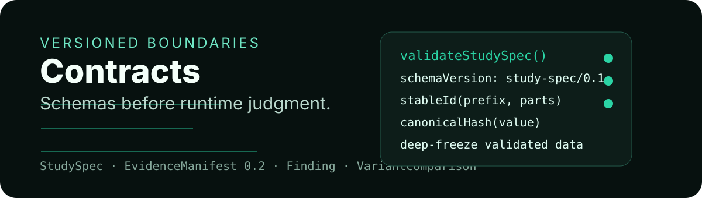

<p align="center">
  
</p>

<div align="center">

# @persona-runtime/contracts

**Versioned JSON contracts for Persona Runtime boundaries.**


[API](#api) · [Contracts](#contracts) · [Use](#use) · [Safety](#safety) · [Test](#test)

</div>

---

## Story card

| Field | Value |
| --- | --- |
| Audience | Runtime, evaluator, reporter, and adapter package authors. |
| Value | Validate every cross-module object before it becomes runtime state or report output. |
| Proof | `node --test test/*.test.mjs` covers StudySpec validation, stable IDs, typed-action secrecy, sealed manifests, and finding evidence refs. |
| First action | Import a validator and reject invalid contract data at the package boundary. |
| Visual theme | Sealed evidence ledger: dark technical grid, green schema checkpoints. |

## What it owns

- Schema version constants for StudySpec, SessionRecord, Observation, InteractionEvent, EvidenceManifest 0.2, evaluations, findings, validity, and variant comparison.
- Runtime validation with `ContractValidationError` and path-aware messages.
- Canonical JSON hashing and stable ID helpers.
- Secret redaction for StudySpec hashing.
- A small migration registry, currently used for `evidence-manifest/0.1` → `evidence-manifest/0.2`.

## What it does not own

- Playwright, browser sessions, or model providers.
- YAML loading or CLI argument parsing.
- Business-specific oracles beyond contract shape validation.
- Report rendering.

## API

| Export | Purpose |
| --- | --- |
| `validateStudySpec(value)` | Validates and freezes a canonical StudySpec. |
| `validateSessionRecord(value)` | Validates sealed/session-facing session records. |
| `validateObservation(value)` | Validates semantic, visual, runtime, and oracle observation shape. |
| `validateInteractionEvent(value)` | Validates action/result events and typed-input secrecy. |
| `validateEvidenceManifest(value)` | Requires EvidenceManifest 0.2 to be sealed. |
| `validateFunctionalEvaluation(value)` | Validates deterministic/browserless functional output. |
| `validateFinding(value)` | Requires findings to reference events and evidence. |
| `validateSimulationValidityReport(value)` | Validates calibration, diversity, stability, and risk output. |
| `validateVariantComparisonSpec(value)` / `validateVariantComparisonReport(value)` | Validates baseline/candidate comparison input and result. |
| `canonicalJson(value)` / `canonicalHash(value)` | Stable serialization and hashing independent of object key order. |
| `stableId(prefix, parts)` | Creates deterministic IDs from canonical parts. |
| `createSessionId`, `createEventId`, `createEvidenceId` | Stable ID helpers for runtime objects. |
| `migrateContract(value, to)` | Runs a registered migration. |
| `validators` | Registry used by `validateContract(name, value)`. |

## Contracts

Current schema version constants:

```text
study-spec/0.1
session/0.1
observation/0.1
interaction-event/0.1
evidence-manifest/0.2
functional-evaluation/0.1
friction-point/0.1
finding/0.1
simulation-validity/0.1
variant-comparison-report/0.1
```

Validated objects are deeply frozen. Treat validation as the handoff point: mutate by creating a new object, not by editing the validated one.

## Use

```js
import {
  canonicalHash,
  createSessionId,
  STUDY_SPEC_VERSION,
} from "@persona-runtime/contracts";

const sessionId = createSessionId({
  runId: "run-1",
  taskId: "checkout",
  personaId: "careful_business_buyer",
  seed: 101,
});

console.log(STUDY_SPEC_VERSION, sessionId, canonicalHash({ b: 2, a: 1 }));
```

## Safety

- Typed browser actions must use `valueRef`; plaintext `value` is rejected for `type` actions.
- Evidence manifests must be sealed before validation succeeds.
- Evidence entry paths must be contained relative paths, not absolute paths or `..` traversal.
- Findings and friction points need event and evidence references.
- Secret fixture values are redacted before StudySpec hashing.

## Test

```bash
pnpm --filter @persona-runtime/contracts test
pnpm --filter @persona-runtime/contracts typecheck
```
