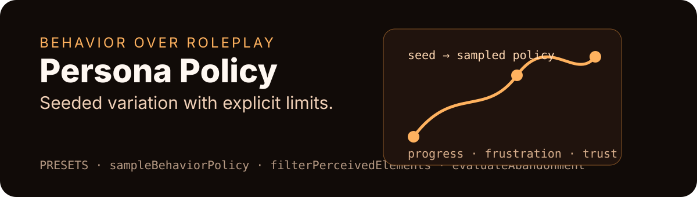

<p align="center">
  
</p>

<div align="center">

# @persona-runtime/persona-policy

**Seeded behavior policies for synthetic browser sessions.**


[Policy model](#policy-model) · [API](#api) · [Use](#use) · [Safety](#safety) · [Test](#test)

</div>

---

## Story card

| Field | Value |
| --- | --- |
| Audience | Behavioral runtime authors who need reproducible policy variation without pretending demographics are destiny. |
| Value | Encode retry, backtrack, abandonment, signup resistance, reading depth, and attention as sampled policy values. |
| Proof | Vitest coverage checks seeded reproducibility, probability validation, hidden/occluded filtering, state reduction, and abandonment. |
| First action | Derive a session seed, sample a preset, and serialize the sampled policy with the session. |
| Visual theme | Seeded behavior curve: orange state trajectory over progress, frustration, and trust. |

## What it owns

- Behavior policy distributions and preset definitions.
- Deterministic random sampling from a session seed.
- Runtime persona state reduction.
- Perceived element filtering for attention policy.
- Abandonment decisions as normal behavioral outcomes.

## What it does not own

- Browser execution.
- Model prompting or structured output validation.
- StudySpec validation.
- Findings, reports, or calibration claims.
- Demographic prediction.

## Policy model

Built-in presets:

```text
impatient_new_user
careful_business_buyer
low_domain_knowledge_user
exploratory_power_user
price_sensitive_user
```

Each preset is a `BehaviorPolicyDefinition` with distributions for retry, backtrack, abandonment, signup resistance, price sensitivity, exploration, reading depth, error recovery, and no-action propensity.

## API

| Export | Purpose |
| --- | --- |
| `PRESETS` | Built-in behavior policy definitions. |
| `deriveSessionSeed(studySeed, taskId, personaId, variant, repetitionIndex)` | Deterministic seed derivation for one session. |
| `createRandom(seed)` | Reproducible pseudo-random number generator. |
| `sampleDistribution(distribution, random)` | Samples fixed, categorical, beta, normal, or empirical distributions. |
| `sampleBehaviorPolicy(definition, seed)` | Samples and serializes a behavior policy. |
| `createPersonaState()` | Creates initial progress/frustration/trust state. |
| `reducePersonaState(state, signals)` | Updates state from runtime signals. |
| `filterPerceivedElements(elements, attention, seed)` | Keeps only behaviorally perceived candidates. |
| `evaluateAbandonment(input)` | Returns whether the session should abandon and why. |

## Use

```ts
import {
  PRESETS,
  deriveSessionSeed,
  sampleBehaviorPolicy,
} from "@persona-runtime/persona-policy";

const seed = deriveSessionSeed(101, "upload-task", "impatient_new_user");
const sampled = sampleBehaviorPolicy(PRESETS.impatient_new_user, seed);

console.log(sampled.seed, sampled.values.abandonmentPropensity);
```

## Safety

- Behavior is encoded as policy values, not only narrative text.
- Sampling is deterministic for the same seed and session identity.
- Hidden and occluded controls are filtered out of perceived elements.
- Abandonment is allowed to be a terminal outcome; success is not forced.
- This package does not claim actual user conversion or preference prediction.

## Test

```bash
pnpm --filter @persona-runtime/persona-policy test
pnpm --filter @persona-runtime/persona-policy typecheck
```
