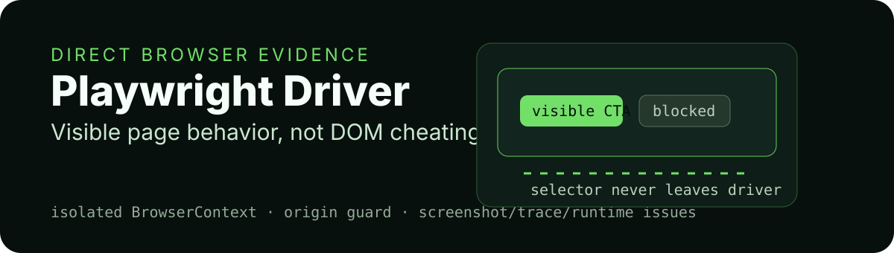

<p align="center">
  
</p>

<div align="center">

# playwright-driver

**Direct Playwright browser evidence for Persona Runtime.**


[Driver contract](#driver-contract) · [Evidence](#evidence) · [Safety](#safety) · [Use](#use) · [Test](#test)

</div>

---

## Story card

| Field | Value |
| --- | --- |
| Audience | Runtime integrators who need real browser observations without exposing selectors to persona policy. |
| Value | Capture visible semantic, visual, console, network, download, trace, and video evidence from isolated BrowserContexts. |
| Proof | Vitest coverage checks isolated contexts, hidden/occluded control blocking, origin policy, mutation/upload guards, redaction, disabled evidence policy, and unsafe URL rejection. |
| First action | Create a driver, start a session with an allowed HTTP origin, observe, execute observation-local actions, then close. |
| Visual theme | Browser viewport with visible CTA and blocked selector boundary. |

## What it owns

- Direct Playwright `BrowserContext` lifecycle per session.
- Semantic snapshots of visible headings, landmarks, text, and interactive elements.
- Observation-local element IDs; selectors stay inside the driver.
- Screenshot, trace, video, console, network, download, popup, and dialog evidence.
- Origin, navigation, mutation, upload, destructive-action, and storage-state guards.
- Secret redaction in page title, URL, semantic text, runtime issues, and evidence policy downgrades.

## What it does not own

- Session orchestration or budgets.
- Persona decision-making.
- Oracle evaluation.
- Report rendering.
- Arbitrary JavaScript or shell actions.

## Driver contract

`createPlaywrightDriver()` returns an object with:

| Method | Purpose |
| --- | --- |
| `start(input)` | Launches browser/context/page and navigates to the trusted start URL. |
| `observe(handle)` | Captures a stabilized observation and evidence references. |
| `execute(handle, action)` | Performs an allowed action from the latest observation. |
| `close(handle)` | Stops tracing/video, closes context/browser, and returns close evidence. |
| `closeAll()` | Closes all live sessions owned by the driver. |

## Evidence

Evidence entries can include:

```text
screenshot
trace
video
console_issue
network_failure
download
```

If `valueRefs` contain secrets, screenshot, trace, and video evidence are disabled for that session.

## Safety

- Only `http:` and `https:` base URLs are accepted.
- Metadata hosts such as `169.254.169.254` are blocked.
- `allowedOrigins` gates all requests.
- `allowExternalOrigin: false` keeps navigation on the base origin.
- Hidden, occluded, off-viewport controls are not exposed to persona policy.
- Forged or stale element IDs are blocked.
- Destructive confirmation/payment-like controls are blocked when `stopBeforeConfirmation` is enabled.
- `storageStatePath` must resolve within the workspace.

## Use

```js
import { createPlaywrightDriver } from "playwright-driver";

const driver = createPlaywrightDriver({ browserName: "chromium" });
console.log(typeof driver.start, typeof driver.observe, typeof driver.execute, typeof driver.close);
```

For an end-to-end browser run, use this package through `@persona-runtime/runtime-core` or the `persona-runtime` CLI so evidence sealing and evaluation gates remain enforced.

## Test

```bash
pnpm --filter playwright-driver test
pnpm --filter playwright-driver typecheck
```
