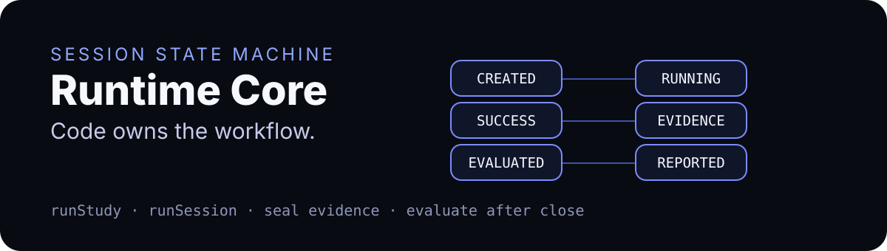

<p align="center">
  
</p>

<div align="center">

# @persona-runtime/runtime-core

**Session orchestration for evidence-first behavioral runs.**


[Flow](#flow) · [API](#api) · [Use](#use) · [Safety](#safety) · [Test](#test)

</div>

---

## Story card

| Field | Value |
| --- | --- |
| Audience | Runtime integrators wiring drivers, policies, oracles, stores, evaluators, and reporters. |
| Value | Keep session lifecycle, budgets, evidence sealing, and post-seal evaluation deterministic in code. |
| Proof | `node --test test/*.test.mjs` covers close-before-seal, seal failure, hidden observation filtering, budgets, concurrency, cancellation, and variant order. |
| First action | Build a session matrix or run one session with fake driver/policy/oracle/store boundaries. |
| Visual theme | State-machine ledger: dark execution lane, browser closure gate, sealed evidence checkpoint. |

## What it owns

- Session state transitions from `CREATED` through `REPORTED`.
- Matrix expansion for task × persona × seed × optional variant.
- Bounded concurrency and cancellation checks.
- Action, time, and no-progress budgets.
- Per-session JSONL/file store helpers.
- Evidence manifest sealing through `@persona-runtime/contracts`.
- Evaluation/reporting phase gates after evidence is sealed.

## What it does not own

- Browser implementation details.
- Model provider calls.
- Persona sampling internals.
- HTML, GitHub, or Markdown rendering.
- Direct repository mutation.

## Flow

```text
runStudy
  └─ runSession
       ├─ driver.start
       ├─ observe → oracle → policy.decide → execute
       ├─ driver.close
       ├─ seal EvidenceManifest 0.2
       └─ evaluateSealedSession → markSessionReported
```

The browser driver closes before the session reaches `EVIDENCE_SEALED`. Evaluation helpers reject unsealed session results.

## API

| Export | Purpose |
| --- | --- |
| `runStudy(options)` | Runs the task/persona/seed/variant matrix with bounded concurrency. |
| `runSession(options)` | Runs one browser-policy-oracle loop and seals evidence. |
| `buildSessionMatrix({ study, runId })` | Expands StudySpec runtime dimensions into session entries. |
| `createSessionRecord(...)` | Creates a frozen runtime session object. |
| `transitionSession(session, phase, details)` | Applies legal state transitions only. |
| `toSessionRecord(session)` | Converts runtime session state to contract `session/0.1`. |
| `evaluateSealedSession(...)` | Runs a browserless evaluator only after evidence is sealed. |
| `markSessionReported(...)` | Advances an evaluated session to reported. |
| `createFileSessionStore({ rootDir, sessionId })` | Writes `session.json`, observations JSONL, events JSONL, and manifest. |
| `deriveInteractionEvent(...)` | Converts one action result into an interaction event. |
| `RuntimeCoreError` / `RUNTIME_ERROR_CODES` | Structured runtime failures. |

## Use

```js
import { buildSessionMatrix } from "@persona-runtime/runtime-core";

const matrix = buildSessionMatrix({
  runId: "run-1",
  study: {
    study: { id: "demo" },
    environment: { baseUrl: "http://127.0.0.1:4173" },
    tasks: [{ id: "task", maxActions: 3, maxDurationMs: 1000, maxConsecutiveNoProgressActions: 1 }],
    personas: [{ id: "persona" }],
    runtime: { seeds: [101], concurrency: 1 },
  },
});

console.log(matrix[0].sessionId);
```

## Safety

- Invalid transitions throw instead of silently rewriting status.
- Actions can reference only elements in the current perceived observation.
- Evidence seal failure becomes `EVIDENCE_SEAL_FAILED`; it cannot become a false pass.
- `semanticSnapshot: "off"` omits semantic evidence and leaves judgment to components that can handle missing evidence.
- Post-terminal phases preserve the terminal status while adding sealed/evaluated/reported state.

## Test

```bash
pnpm --filter @persona-runtime/runtime-core test
pnpm --filter @persona-runtime/runtime-core typecheck
```
